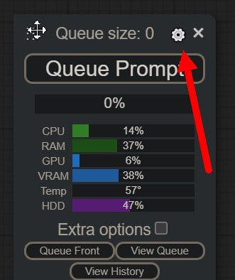

# ComfyUI RUS

Только русская версия, только для России!

Установочный BAT-файл для сборки "на лету" текущих git-версий для карт "NVIDIA":

- **ComfyUI**
- **ComfyUI-Manager**
- **NStor-ComfyUI-Translation**
- **Crystools**
- **comfyui mbt**

Фактически, для установки и работы, вам потребуется только три bat-файла.

---

Для сборки "на лету" используются только git-версии "ComfyUI" и всех остальных компонентов.

Для установки системмы требуется установленный локально **GIT** (а PATH) и "**Python 3.10**"

---

Git можно скачать тут: **https://git.github.io/git-scm.com/download/win**

Python 3.10 скачать тут: **https://www.python.org/ftp/python/3.10.0/python-3.10.0-amd64.exe**

---

<a href="https://github.com/Nestorchik/ComfyUI-RUS/releases/download/ComfyUI_RUS/ComfyUI-RUS_bat_files.zip">**>>> Загрузите архив с тремя bat-файлами отсюда <<<**</a>

Создайте пустой каталог (к примеру "c:\1") с скопируйте туда следующие файлы из архива:

- **install_comfyui.bat**
- **run_comfyui.bat**
- **update_comfyui.bat**

Запуск инсталляции дистрибутива "ComfyUI" производится файлом <ins>"**install_comfyui.bat**"</ins>.

---

Перед запуском установите значение переменной "**python=c:\p31\python.exe**" в файле "**install_comfyui.bat**" на реальное расположение питона 3.10 версии у вас!

**GIT-должен быть прописан в PATH!**

Для повторной инсталляции удалите полностью папку "**ComfyUI**", и запустите файл инсталятора снова.

Установка и сборка происходит автоматически, в установочном файле прописаны все команды для скачивания и установки всего, что нужно для работы русского пакета "**ComfyUI**". Все пакеты питона, и модули скачиваются и копируются на свое место автоматически.

Приложен файл для **git**-обновления всех установленныс компонентов "**update_comfyui.bat**".

Поместите его рядом с файлом "**install_comfyui.bat**" и запускайте для git-обновления "**ComfyUI**".

Запуск браузера после старта сервера: **http://127.0.0.1:8188**

Запуск установленного интерфейса: #"run_comfyui.bat"

---

Информация по проекту "**NStor-ComfyUI-Translatio**n"

Проект русской локализации "**ComfyUI**"

Локализация "**ComfyUI**" производится без какого-либо вмешательства в код самой "**ComfyUI**", путем "перехвата строк на лету" и замены определенных, английских "буквосочетаний" на их русские аналоги. Установка и удаление этого модуля локализации никак не влияет на работоспособность самой "ComfyUI" и любых компонентов установленных в системе!

Локализатор устанавливается на любую версию "**ComfyUI**" как обычная нода через "**ComfyUI-Manager**" - "**Install via Git URL**" и ввода адреса:

- **https://github.com/Nestorchik/NStor-ComfyUI-Translation.git**

# 

Далее идем в "шетеренку"...

# 

В настройках пункт "AGLTranslation-langualge" выбрать язык "Русский".

# 

Переключение языка "**Русский/Английский**" кнопкой менеджера "**Switch Locale/Смена языка**".
Время переключения интерфейса "**Русский/Английский**" - моментальное.

# 

Проект содержит только русский (и английский) языки, все остальные языки отключены, поскольку он рассчитан только на территорию России. Проект локализации "AIGODLIKE" "ru-RU" по соглашению с Китаем берется отсюда, т.е., фактически, официальным проектом русской локализации "**ComfyUI**" является этот ресурс. Здесь всегда последние обновления русской локализации для "**ComfyUI**", публикуются онлайн.

Обновление "**ComfyUI**" и локализации файлом "**update_comfyui.ba**t"

В настоящий момент переведены все встроенные меню, панели, диалоги, названия и т.п., до чего смогли технологически добраться не влезая и не изменяя код самого "**ComfyUI**", т.к. это считаем необходимым условием доверия к подобного рода софту. Мы никогда не изменяем ни одного знака (даже пробела) в исходном коде, который написан не нами.

Любые обвинения типа **"До установки вашего приложения все работало, а теперь перестало"** являются необоснованными. Ни установка, ни удаление пакета локализации, никак не влияет на работоспособность основной системы.

В системе не переводились наименования нод, пунктов входов/выходов, заголовки, пункты настроек и т.п., которые являются общепринятыми привычными для пользователей, знакомых с "**ComfyUI**". Исключением являются лишь некоторые "обще-понятные" названия.

В дальнейшем планируется локализовать основные популярные ноды и модули. Если вас что-то не устраивает в переводе, или вы начинаете путаться в локализованной версии, просто нажмите кнопку **"Смена языка"** ("Switch locale"), и произойдет моментальное переключение на встроенный английский язык.

Уже переведенные ноды (файлы локализации) находятся в папке "**custom_nodes\NStor-ComfyUI-Translation\ru-RU\Nodes**" в файлах с именем, одинаковым с названием ноды, и с расширением JSON.

Перевод встроенных нод в файле - **internal.json**

Для изменения перевода откройте нужный файл и измените русское название на свое, если вам так больше нравится.

Для выключения перевода конкретных нод(ы), просто переименуйте нужный файл так, чтобы его имя не совпадало с названием ни одной ноды, установленной в системе, а лучше просто удалите этот файл. После чего перезагрузите питон, и выбранная нода больше переводиться не будет. Для восстановления перевода, просто закиньте одноименный с нодой файл перевода с расширением JSON в папку "**Nodes**", и перезагрузите питона.

Далее - немного скриншотов переведенного интерфейса:

# 

# 

# 

# 

# 

P.S.

Претензии типа:

- "А вот неправильно там вот переведено!!!"

- "А у вас так, а надо было так!"

не принимаются!)))

Файлы у вас есть, зайдите и напишите сами так, как вам надо )))

Если вы сами что-то переведете, то присылайте нам, мы включим ваш перевод в выпуск, не вопрос )))

Идея этого проекта пошла от того осознания, что новичку, который еще не освоил азы генерации в нейросетях, очень сложно не то, что "разобраться в структуре управления", а даже просто "с глаза переводить технологические названия узлов и терминов", и русский интерфейс, на первых парах, поможет просто понять что и для чего используется.

Удачи! )
NStor
@srigert
https://t.me/comfyui_rus

---
